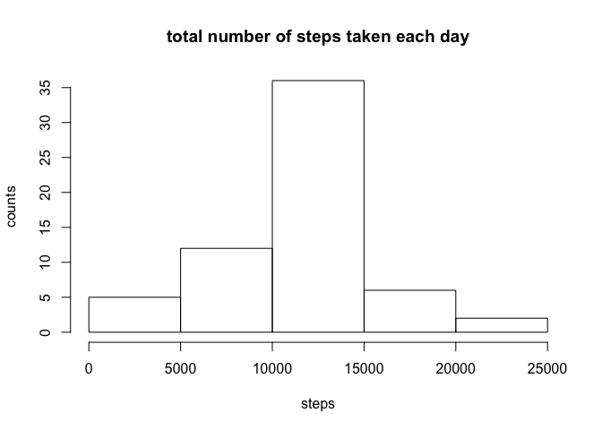
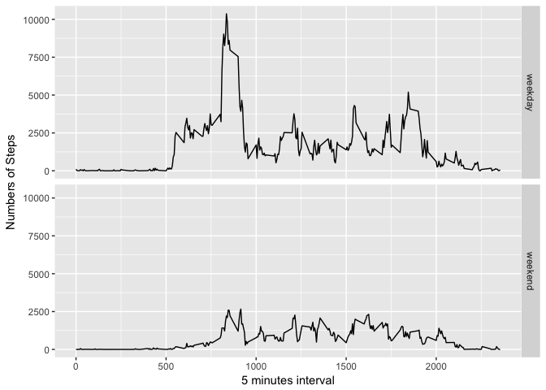

Reproducible Research: Peer Assessment 1
========================================

1. Loading and preprocessing the data
-------------------------------------

    library("ggplot2")  
    act <- read.csv("activity.csv")

2. Histogram of the total number of steps taken each day
--------------------------------------------------------

    agg <- aggregate(steps~date, act, sum)
    ggplot(agg, aes(steps)) + geom_histogram(binwidth = 1000)

3. Mean and median number of steps taken each day
-------------------------------------------------

    mean(agg$steps)

    ## [1] 10766.19

    median(agg$steps)

    ## [1] 10765

4. Time series plot of the average number of steps taken
--------------------------------------------------------

    step_interval <- aggregate(steps ~ interval, act, mean)
    ggplot(step_interval, aes(interval, steps)) + geom_line() + xlab("5-minute interval") + 
        ylab("average number of steps taken")

5. The 5-minute interval that, on average, contains the maximum number of steps
-------------------------------------------------------------------------------

    step_interval[which.max(step_interval$steps), ]

    ##     interval    steps
    ## 104      835 206.1698

6. Code to describe and show a strategy for imputing missing data
-----------------------------------------------------------------

    missing <- is.na(act$steps)
    table(missing)

    ## missing
    ## FALSE  TRUE 
    ## 15264  2304

7. Histogram of the total number of steps taken each day after missing values are imputed
-----------------------------------------------------------------------------------------

    imputed <- function (step, interval) {
        filled <- NULL
        if (!is.na(step)) {
            filled <- step
        } else {
            filled <- mean(step_interval$steps[step_interval$interval == interval])
        }
        return(filled)
    }

    filledDate <- act
    filledDate$steps <- mapply(imputed, filledDate$steps, filledDate$interval)
    stepsByDate <- aggregate(steps~date, filledDate, sum)
    hist(stepsByDate$steps, xlab = "steps", ylab = "counts", main = "total number of steps taken each day")

8. Panel plot comparing the average number of steps taken per 5-minute interval across weekdays and weekends
------------------------------------------------------------------------------------------------------------

    weekdaysOrWeekend <- function(day) {
        day <- weekdays(day)
        if (day %in% c("Monday", "Tuesday", "Wednesday", "Thursday", "Friday")) {
            return("weekday")
        } else {
            return("weekend")
        }
    }

    filledDate$date <- as.Date(filledDate$date)
    filledDate$date <- mapply(weekdaysOrWeekend, filledDate$date)

    aggByDate <- aggregate(steps~interval + date, filledDate, sum)
    ggplot(aggByDate, aes(interval, steps)) + geom_line() + facet_grid(date ~ .) + 
        xlab("5 minutes interval") + ylab("Numbers of Steps")

